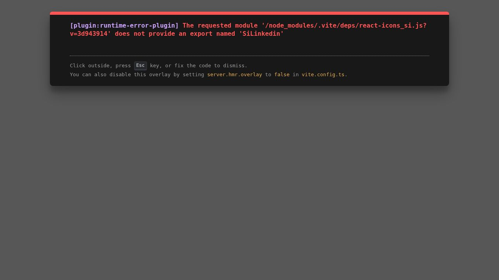

# Deepak Gir — Portfolio

My personal portfolio website — built with React, TypeScript, and Tailwind CSS to showcase my projects, skills, and experience as a Java Developer.

**🔗 Live Site:** https://deepakgirportfolio.netlify.app/



---

## 📌 About

I'm a B.Sc. Computer Science student at **Sindh Madressatul Islam University (SMIU), Karachi**, with hands-on experience building backend-driven web applications using **Java, JDBC, JSP, Servlets, Spring Boot, Hibernate, and MySQL**. This portfolio is a single-page application that brings together my projects, technical skills, and education in one place.

## ✨ Features

- ⚡ Fast, modern single-page app built with **Vite**
- 🎨 Smooth scroll-based navigation with active section highlighting
- 🎬 Animated UI powered by **Framer Motion** (fade-ins, floating badges, animated counters, typing effect)
- 📱 Fully responsive — mobile, tablet, and desktop
- 🌙 Dark, developer-themed UI built with **Tailwind CSS** and **shadcn/ui** components
- 📄 One-click resume download
- 🔗 Direct links to GitHub, LinkedIn, and Email

## 🛠️ Built With

| Category | Tech |
|---|---|
| **Frontend** | React 19, TypeScript |
| **Build Tool** | Vite |
| **Styling** | Tailwind CSS v4, tailwind-merge, tw-animate-css |
| **UI Components** | shadcn/ui (Radix UI primitives) |
| **Animation** | Framer Motion |
| **Icons** | Lucide React, React Icons |
| **Routing** | Wouter |
| **Forms/Validation** | React Hook Form, Zod |

## 📂 Sections

- **Hero** — Introduction with animated role-typing effect
- **About** — Background, education snapshot, and current status
- **Skills** — Languages, Backend, Frontend, Databases, Tools, and Core Concepts
- **Projects** — Featured projects with tech stack and GitHub links
- **Experience** — Internship and work history
- **Education** — Degree details and certifications
- **Contact** — Email, phone, location, and social links

## 🚀 Featured Projects

| Project | Description | Tech Stack |
|---|---|---|
| [User Management Web App](https://github.com/DeepakGir/User-Managment-Web-Application) | Full-stack CRUD app with MVC architecture, form validation, and MySQL integration | Java, JDBC, JSP, Servlets, MySQL |
| [Student Management System](https://github.com/DeepakGir/Student-Management-System-) | Academic record manager with CRUD operations and MySQL via JDBC | Java, JDBC, MySQL |
| [Hotel Room Booking System](https://github.com/DeepakGir/Hotel-Managment-System.git) | Booking management system with create, update, cancel, and view operations | Java, JDBC, MySQL |
| Portfolio Website | This responsive personal portfolio, deployed on Netlify | HTML, CSS, JavaScript |

## 🏃 Getting Started

### Prerequisites
- [Node.js](https://nodejs.org/) (v18 or higher recommended)
- npm

### Installation

```bash
# Clone the repository
git clone https://github.com/DeepakGir/Portfolio.git

# Navigate into the project
cd Portfolio

# Install dependencies
npm install

# Run the development server
npm run dev
```

The app will be available at `http://localhost:5173`.

### Build for Production

```bash
npm run build
```

The optimized output will be in the `dist/` folder, ready to deploy.

### Preview the Production Build

```bash
npm run preview
```

## 📦 Deployment

This project can be deployed on any static hosting platform such as **Netlify**, **Vercel**, or **GitHub Pages**. Simply run `npm run build` and deploy the contents of the `dist/` folder.

## 📫 Contact

- **Email:** deepakgir2026@gmail.com
- **GitHub:** [@DeepakGir](https://github.com/DeepakGir)
- **LinkedIn:** [Deepak Gir](https://www.linkedin.com/in/deepak-gir-5575733b5)
- **Location:** Karachi, Pakistan

---

⭐ If you like this project, feel free to give it a star!
